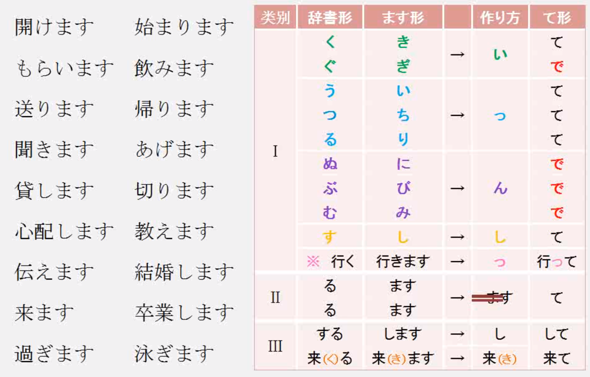

- XX する　→　动词性名词/外来语
- みぎ　―　ひだり　（右-左）

#### 数量词

- 一つ　二つ　…　九つ　十　十一　（いくつ）

- 数词＋量词  册/枚/本/匹/人...  （何＋量词）

- 時間　年間　か月（間）　週間　日間　（何＋量词）
  どれぐらい／どのぐらい
  
- 数量词放在动词前，表时间的不受限制
  > 昨日　ビールを　どれぐらい　飲みましたか。
  > ―　３本　飲みました。

#### で

- 工具手段    

  > バスで　行きます。

- 动作发生的场所    

  > 図書館で　勉強します。

- 限定范围，单位为1的时候可以省略    

  > すみません、この　トマトは　いくらですか。
  >
  > ―　一つ　40円です。　３つで　１００円です。

#### に

- 存在的地点

  >机の上に　本が　あります。

- 时间点

  >森さんは　7時半に　起きます。

- 动作对象

  >私は　李さんに　本を　もらいました。

- 移动目的地（具体的地方）可以与へ替换

  >病院に　行きます。

- 频率的基准

  >月に　3回ぐらい　映画を　見ます。　

- 移动至某地的目的

  >お金を　借りに　来ました。

- 归着点、着落点、附着点

  >車を　ここで（车还要继续走）/ に（车不走了）　止めてください。
  >
  >靴を脱いで、家に　入ってください。

#### を

- 动作内容

  >水を　飲みます。

- 动作的起点

  >毎朝　8時に　家を　出ます。

- 移动经过的场所

  >前の交差点を　曲がってください。

- 动作移动的范围

  >廊下を　走っては　いけません。

#### を与から

- 主语是无意志的　→　から

  >水が　コップから　溢れる（あふれる）。
  >
  >花瓶（はながめ）が　テーブルから　落ちる（おちる）。
  >
  >涙（なみだ）が　目から　出る。

- 动作无意识　→　から

  >彼は　屋上（おくじょう）から　落ちた。

- 具体，有意识　→　都可

  >バスから／を　降りる（おりる）。
  >
  >りんさんが　部屋から　出る。

- 抽象意味上的离开　→　を

  >李さんは　大学を　卒業（そつぎょう）した。

#### て形

- 动词：て

  

- 形容词：い　→　くて

- 名词：だ　→　で

- **てから**

  > エアコンを　消してから、部屋を　出ました。
  >
  > 薬を　飲んでから、ゆっくり　休んでください。

- **ています**　进行时/动作结果/状态持续

  >今　作っていますから、ちょっと　待ってください。
  >
  >地震（じしん）のニュースを　知っていますか。

- てください

  >パスポートを　見せてください。
  >
  >すみませんか、お名前を　教えてくださいませんか。

- ても　いいです／かまいません

  >あのう、ここで　待っても　いいですか。

- では　いけません／だめです

  >ここに　入っては　いけませんよ。